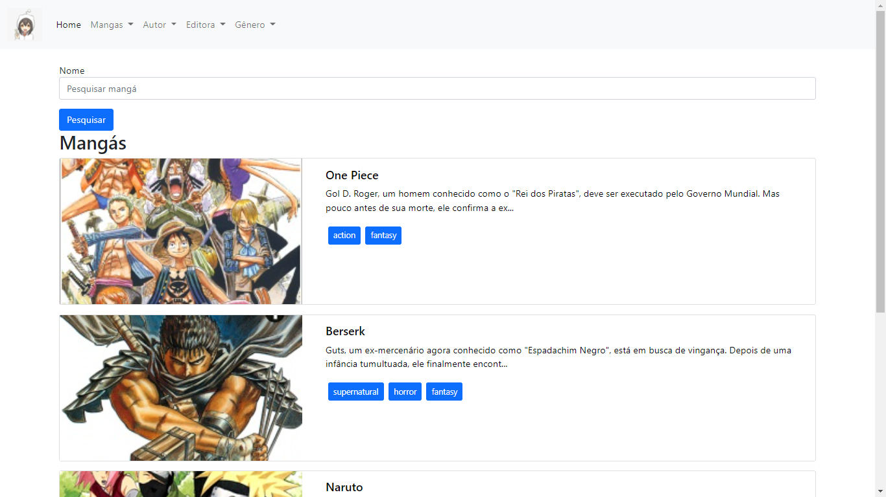
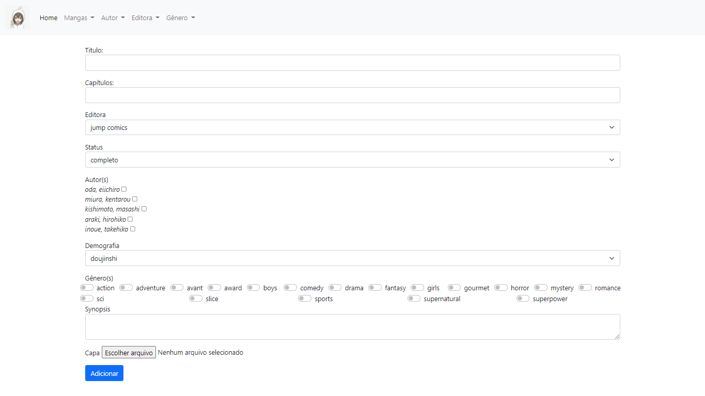
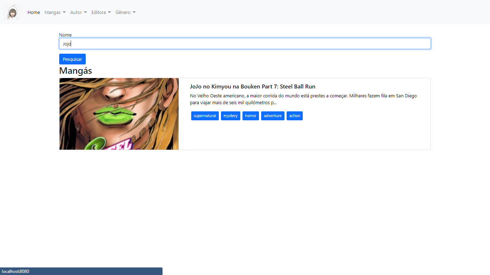

# Exercicio complementar MVC.

## Ferramentas:
- :pushpin: Java 11
- :pushpin: Maven
- :pushpin: MariaDB 10.7


## :dart: Objetivo
Exercício para fixação dos conceitos visto no curso de MVC.

## :tv: Screenshot

<p align="center">
    
    
    
    
</p>


## :cd: Rodar projeto:

Na linha de comando:
Use o ```mvnw``` para ambiente Linux e ```mvnw.cmd``` para Windows

```
./mvnw spring-boot:run
```